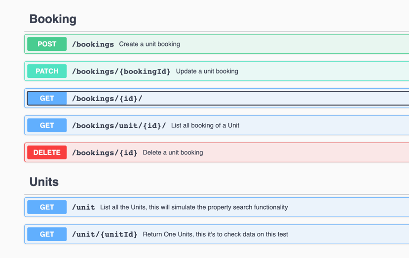

## Run Spring Boot application
```
mvn spring-boot:run
```

## Open API - Swagger

http://localhost:8080/booking-api/swagger-ui/index.html




## In memory DB
http://localhost:8080/booking-api/h2-console
```
JDBC URL: jdbc:h2:mem:booking_db
Username=sa
Password= Empty, no password
```


## Implementation

### out of scope
- Security is no implemented, if it's need it using spring security we cn use JWT or basic auth.
- 

### Details
- I Use Spring Boot to create REST Service to handle booking functionality, and H2 DB to persist the data, which also includes initial data to play with.
- I used the Records type of class for DTO and normal classes for Entities. I thought to use Lombok, but I choose not to because It wasn't too much saving of code.
- I create a repository for Units and UnitBlockTimes, but should be replaced with a call to the units/property domain service
- I use a Custom exception `BookingException` to throw any logic error. Which return a 409 http status.
- I haven't time to add full test coverage, but you can see the `BookingServiceTest` with cover the most relevant logic 


#### Mandatory endpoints:
##### - Create a booking
To create a booking The endpoint only needs the UnitId, GuestId, start and end time.

The logic validates the unit is not booked on booked before and done;t have any block time. also Calculated the number of nights.

```json
{
  "unitId": "3fa85f64-5717-4562-b3fc-2c963f66afa6",
  "guestId": "3fa85f64-5717-4562-b3fc-2c963f66afa6",
  "startTime": "2023-07-06",
  "endTime": "2023-07-06"
}
```
##### - Read 1+ bookings
Doing the documentation I realize I misunderstood the endpoint. What I did was an endpoint to get a specific booking by ID and another to list all the bookings of a property. which has pagination opcion.


##### - Update a booking
To Updates a booking The endpoint needs bookingId as pathVariable and the UnitId, GuestId, start and end time on teh payload.
`/bookings/{bookingId}`

The logic validates the unit is not booked for the new dates and doesn't have any block time. also Calculated the number of nights.
Also, I thought to implement a changelog on the booking to keep history,  but unfortunately, I haven't the time to finish it.
```json
{
  "unitId": "3fa85f64-5717-4562-b3fc-2c963f66afa6",
  "guestId": "3fa85f64-5717-4562-b3fc-2c963f66afa6",
  "startTime": "2023-07-06",
  "endTime": "2023-07-06"
}
```

http://localhost:8080/booking-api/swagger-ui/index.html#/Booking/updateBooking


##### - Delete a booking


## Data to play

####  Hosts

| host ID                              | 
|--------------------------------------|
| 9ac1066b-cc27-4c63-ac9e-31342776c851 |
| b81f02cf-975b-49ab-83c1-fea533e5aba5 | 
| bc37c9ef-d09f-4495-901e-077cac212fa3 |
| a6d02180-c161-4229-8342-d4afd9073316 |
| 252c7811-2aff-47f6-a17a-32b6213faed7 |
| 75933063-5afb-4ebf-85c1-e39d78a98cf7 |


####  Guests
| Guest Id                             | 
|--------------------------------------|
| 1fd7bba7-eef5-4c14-bf95-495a0e2bb04b |
| 57a3d914-648c-4b55-939f-037018b43e87 | 
| c1ff6f92-adc4-4909-aa64-4ded58507e25 |
| e77bee85-e43c-44b5-98d0-bec9e663b0f8 |
| c0c590e2-739d-4f42-8fd9-ff677fd16796 |
| 0e8e286e-ff7d-42f6-b301-0070ddcc6c07 |


#### Available Units (properties) to book

| Unit ID                              | Host Id                              | Unit Name             |
|--------------------------------------|--------------------------------------|-----------------------|
| d2c1848e-5c92-4d0b-83a7-6d8e1e1e6aeb | 9ac1066b-cc27-4c63-ac9e-31342776c851 | Lake House            |
| 1e5e9d5c-61e9-4a6d-a7fc-8ad42e679a2a | 9ac1066b-cc27-4c63-ac9e-31342776c851 | Downtown Party House  |
| 4f53a437-9ff7-4375-a4a7-93dbf67839e2 | 9ac1066b-cc27-4c63-ac9e-31342776c851 | Mountain Retreat      |
| 9deaa0c1-19b2-4d08-9a6b-08be38d74639 | b81f02cf-975b-49ab-83c1-fea533e5aba5 | Seaside Villa         |
| c14c13b6-36a1-4c23-95e4-cd53be01d74e | b81f02cf-975b-49ab-83c1-fea533e5aba5 | Rustic Cabin          |
| 71960f77-7f77-42f9-8a53-f0f2b63f4963 | bc37c9ef-d09f-4495-901e-077cac212fa3 | Luxury Penthouse      |
| e331245d-eb76-4d5c-b1a6-2d301d85c515 | bc37c9ef-d09f-4495-901e-077cac212fa3 | Countryside Farmhouse |
| 7a3e9eab-0b95-4b85-b305-7a97c64b5720 | a6d02180-c161-4229-8342-d4afd9073316 | City View Apartment   |
| b8b641f0-35db-480d-bc4f-4e92840c218a | a6d02180-c161-4229-8342-d4afd9073316 | Beachfront Bungalow   |
| 4c1a14b2-6b9f-4210-a32a-7b30aeb46ed7 | a6d02180-c161-4229-8342-d4afd9073316 | Cozy Cottage          |
| 33ef1f2c-1f6f-4e61-9be7-00ff08078983 | 252c7811-2aff-47f6-a17a-32b6213faed7 | Urban Loft            |
| 979cd7ae-2c02-49a4-866f-76a68ac7aeb3 | 252c7811-2aff-47f6-a17a-32b6213faed7 | Historic Manor        |
| 82efc155-4b5a-459f-8e1e-27e35eae1be2 | 252c7811-2aff-47f6-a17a-32b6213faed7 | Modern Townhouse      |
| d5a5f4c6-781b-4ad9-b4a6-9ee85d8c5e3e | 75933063-5afb-4ebf-85c1-e39d78a98cf7 | Ski Chalet            |
| 1c3a31d2-bb01-4ad4-8a78-7737c0abca7f | 75933063-5afb-4ebf-85c1-e39d78a98cf7 | Waterfront Estate     |


#### Unit Block Dates

| BlockTimeId                          | Unit ID                              | START_TIME | END_TIME   | REASON          | BLOCK_STATUS |
|--------------------------------------|--------------------------------------|------------|------------|-----------------|--------------|
| ed62c458-dee1-4dc2-a496-1e0e0a3b48bf | 1c3a31d2-bb01-4ad4-8a78-7737c0abca7f | 2023-09-18 | 2023-09-17 | A/C maintenance | ACTIVE       |
| 15a954a3-efce-4f08-a5f1-88f90d5b7b5c | 1c3a31d2-bb01-4ad                    | 2023-08-18 | 2023-08-17 | A/C maintenance | ACTIVE       |